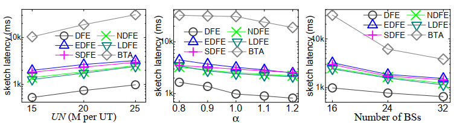
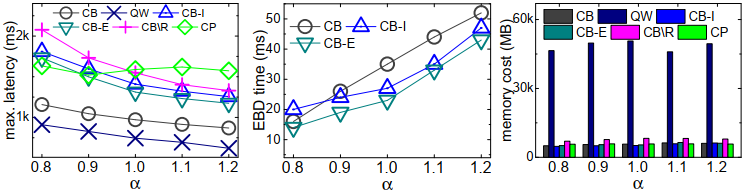

# <a href="https://msca-malot.github.io/" target="_blank"></a>&nbsp;&nbsp;&nbsp;&nbsp; Edge-Quantile-Queries

## Introduction

This repository encapsulates the source code, datasets, and scripts for 
reproducing of our paper entitled 
"Efficient and Error-bounded Spatiotemporal Quantile Monitoring in Edge Computing Environments".

## Acknowledgements

- The module of GK (Greenwald-Khanna) Algorithm is 
based on the [implementation](https://github.com/WladimirLivolis/GreenwaldKhanna) 
by @[WladimirLivolis](https://github.com/WladimirLivolis/GreenwaldKhanna/commits?author=WladimirLivolis).

- The simulated data is generated by the [Generic IoT data simulator](https://github.com/IBA-Group-IT/IoT-data-simulator).

- The real mobility dataset is created from the 
[GeoLife trajectory project](https://www.microsoft.com/en-us/download/details.aspx?id=52367&from=https%3A%2F%2Fresearch.microsoft.com%2Fen-us%2Fdownloads%2Fb16d359d-d164-469e-9fd4-daa38f2b2e13%2F).

## Get Started

A roadmap is here:
- [Prerequisites and Dependencies](#prerequisites-and-dependencies)
- [Project Structure](#project-structure)
- [How to Configure](#how-to-configure)
- [How to Execute](#how-to-execute)

### Prerequisites and Dependencies

The code is implemented in Java 12, without external libraries used.

The code implementation should be executable on all platforms for which there exists a JVM (>=12).

It is suggested to import the project to the IntelliJ IDEA (or other alternative Java IDEs) and run the code from the console.

### Project Structure

```
Edge-Quantile-Queries
┣ Resources // data files
┃ ┣ BaseStation
┃ ┃ ┣ BaseStations16.txt
┃ ┃ ┣ BaseStations24.txt
┃ ┃ ┗ BaseStations32.txt
┃ ┣ Data
┃ ┃ ┣ RealMobilityData
┃ ┃ ┃ ┗ geolife1.txt
┃ ┃ ┗ SyntheticData
┃ ┃ ┃ ┗ synthetic_data_sample_2m.txt
┃ ┗ Query
┃ ┃ ┣ Query30.txt
┃ ┃ ┣ Query40.txt
┃ ┃ ┣ Query50.txt
┃ ┃ ┣ Query60.txt
┃ ┃ ┗ Query70.txt
┣ src
┃ ┣ Config // THE CONFIGURATION PANEL
┃ ┃ ┗ config.java
┃ ┣ Experiment // evaluation
┃ ┃ ┣ ConcurrentQuery.java
┃ ┃ ┣ ConcurrentRunner.java
┃ ┃ ┣ Entrance.java // THE MAIN ENTRANCE OF THE PROJECT
┃ ┃ ┣ SingleQuery.java
┃ ┃ ┗ SingleRunner.java
┃ ┣ GreenwaldKhanna
┃ ┃ ┣ Block.java
┃ ┃ ┣ GK.java
┃ ┃ ┣ GKWindow.java
┃ ┃ ┗ Tuple.java
┃ ┣ Model
┃ ┃ ┣ BaseStation.java
┃ ┃ ┣ Cell.java
┃ ┃ ┗ Query.java
┃ ┣ Socket // socket programming
┃ ┃ ┣ Controller.java
┃ ┃ ┗ Worker.java
┃ ┗ Util // common functions for individual and concurrent query processing
┃ ┃ ┣ ConcurrentQueryUtil.java
┃ ┃ ┗ SingleQueryUtil.java
┣ TestResultLog // the result files
┃ ┣ ConcurrentQueryTestResult.txt
┃ ┗ SingleQueryTestResult.txt
┣ EdgeQuantileMonitor.iml
┣ LICENSE
┗ README.md
```

### How to Configure

Once the project is imported in the IDE, you can edit 
`/src/Config/config.java` for changing experimental settings. 
The configurable parameters are listed below.

```java
    /* the baseline methods:
       ["DFE", "NDFE", "EDFE", "LDFE", "SDFE", "BTA"] for singleQuery
       ["QW", "CB", "CB-I", "CB-E", "CB/R", "CP"] for ConcurrentQuery
    */
    public static String Method = "CB";
    
    /* the number of base stations:
       "./src/Data/BaseStations[16|24|32].txt"
    */
    public static String BaseStationFile = "./Data/BaseStations16.txt";
    
    /* the number of base stations:
       "./src/Data/Query[30|40|50|60].txt"
     */
    public static String QueryFile = "./Data/Query50.txt";
    
    /* the error bound strictness \alpha
       [0.8, 0.9, 1.0, 1.1, 1.2]
    */
    public static double Alpha = 1.0;

    /* the cell side length \mathit{ll}
       [250, 500, 1000]
     */
    public static int Cell_length = 1000;

    /* dataVolume for one Cell; UN = \# of cells * dataVolume.
       when Cell_length = 1000, there are 25 cells in total, for UN = 25M, dataVolume = 1000000;
       when Cell_length = 500, there are 100 cells in total, for UN = 25M, dataVolume = 250000;
       when Cell_length = 250, there are 400 cells in total, for UN = 25M, dataVolume = 62500;
     */
    public static int dataVolume = 500000;

    /* relaxing factor
     */
    public static double RelaxRate = 0.2;

    /* reserach project objective: minMax or minAvg
     */
    public static String RelaxMethod = "minMax";
```

The repository contains a good number of algorithms for comparisons, which are described as follows.
- For individual query processing
  - DFE: data fraction estimation (algorithm 1 proposed in our paper).
  - NDFE: each allocated sketch takes the original data volume when processing a query.
  - EDFE: when a saturated sketch is found, its excess data fraction is undertaken by an unsaturated sketch with the minimum approximation error; this procedure is repeated until no new sketch becomes saturated.
  - LDFE: differs from EDFE in that the excess data fraction is always undertaken by an unsaturated sketch with the minimum UL.
  - SDFE: the excess data fraction is undertaken by a randomly selected unsaturated sketch.
  - BTA: all data is forwarded for processing to the best sketch with the minimum UL in { s_i \in S(q) \mid \epsilon_i \leq b }.
- For concurrent query processing
  - CB: cell-based mechanism proposed in our paper.
  - QW: a set of sketches is allocated for each concurrent query.
  - CB-I/CB-E: each query always includes/excludes all its ICs in approximation.
  - CB/R: the error bound of the current bottleneck cell is set directly to the minimum error bound of its relevant queries; this is repeated when the current bottleneck cell cannot be tuned due to the error bounding restriction.
  - CP: sketches are allocated for each divided cell and are gathered at a centralized processing node that processes each query in parallel by merging a corresponding set of gathered sketches. To ease the management of sketches, a unified approximation error is employed that satisfies the strictest error bound among all queries.

### How to Execute

you can run the experiments from `/src/Experiment/Entrance.java` as follows.

```java
public class Entrance {
    public static void main(String[] args) throws IOException {
        if (config.Method.equals("DFE") || config.Method.equals("EDFE") || config.Method.equals("LDFE") ||
                config.Method.equals("NDFE") || config.Method.equals("SDFE") || config.Method.equals("BTA")){
            SingleQuery.SingleQueryRun(); // processing queries individually
        }
        else {
            ConcurrentQuery.ConcurrentQueryRun(); // processing queries concurrently
        }
    }
}
```

The console will output some intermediate results.
The detailed results will be dumped to the files 
`/TestResultLog/SingleQueryTestResult.txt` and 
`/TestResultLog/ConcurrentQueryTestResult.txt`.

A sample is given below:
```text
Time cost of dataRedistribution: 90 ms
 

GridID: 0
Model.BaseStation id: 1
dataSize: 1000000
GK  cost: 1825ms error: 0.05

...
```

The configuration of experiment parameters is introduced below.

## Results and Findings

Below we showcase some experimental results we obtained from the code implementation.
An extensive experimental studies can be found in our paper.
Note that we validate the efficiency results including maximum/average query latency and EBD time in
our own testing environment (CPU: Core i7-10510U @ 1.80GHz; Memory: 8GB). 
One with a different CPU and/or memory size should get
the results with similar trends as reported in our paper.

### Studies on Individual Query Processing



- DFE clearly perform best in all tests.
- BTA incurs orders of magnitude longer time than other algorithms.

### Studies on Concurrent Query Processing



- QW takes the least time but consumes a huge memory overhead.
- CB incurs a little more time than QW while consuming 5-6 times less memory compared to QW.
- CP performs worst because it employs a stringent approximation error for all sketches.
- CB-E takes several milliseconds less than CB and CB-I to finish the EBD process.

## Contributors


This is a joint work by AAU (Denmark), SUSTech (China), and RUC (Denmark).

- Lanjing Yi constructed the project and implemented the query processing algorithms.
- Xinle Jiang created the real mobility dataset for experiments.

## Citation

If you use our code for your research work, please cite our paper as follows.
```
@article{li2022efficient,
  title={Efficient and Error-bounded Spatiotemporal Quantile Monitoring in Edge Computing Environments},
  author={Li, Huan and Yi, Lanjing and Tang, Bo and Lu, Hua and Jensen, Christian S.},
  year={2022}
}
```


